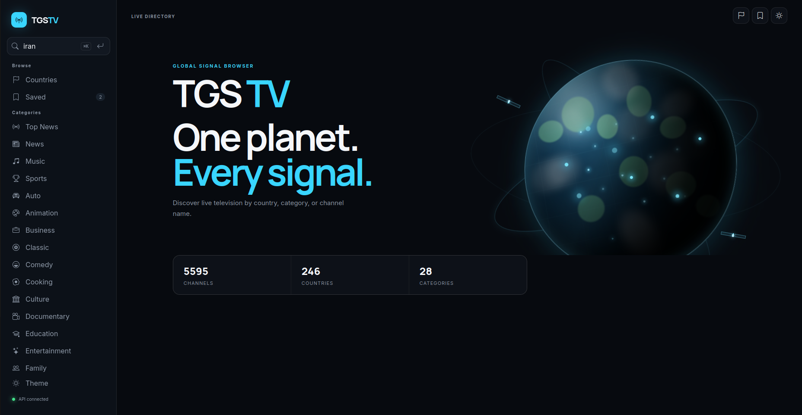

# TGS — Television Global Service

A production-ready platform for cataloging, managing, and querying live television channels from around the world.

TGS provides a clean GraphQL API for public consumption and a full Django admin for content management, monitoring, and scheduled background work.

---
<p align="center">
  
</p>
---

## What you get

- **Public GraphQL API** — search channels and countries with pagination, free-text search across name, category, language, and location.
- **Admin dashboard** — manage channels, countries, and categories; monitor service health and background jobs.
- **Clean architecture** on the channel service (domain → application → infrastructure → presentation) so the public API stays stable while storage and delivery evolve.
- **Docker Compose stack** — Postgres, Redis, channel service, admin, Celery worker + beat, and a lightweight frontend demo.
- **Development-friendly** — in-memory repositories for local work, full Postgres path for production, unit tests for both.

---

## Architecture at a glance

```
┌─────────────────┐     GraphQL      ┌──────────────────────┐
│  test_frontend  │ ───────────────► │   channel_service    │
│  (demo UI)      │                  │  FastAPI + Strawberry│
└─────────────────┘                  │  (read-only)         │
                                     └──────────┬───────────┘
                                                │
                                     ┌──────────▼───────────┐
                                     │      PostgreSQL      │
                                     └──────────▲───────────┘
                                                │
┌─────────────────┐     Django ORM   ┌──────────┴───────────┐
│  admin_service  │ ───────────────► │                      │
│  + Celery       │                  │   Shared catalog     │
└─────────────────┘                  └──────────────────────┘
```

- **channel_service** is intentionally read-only and hexagonal. Domain entities and repository ports sit at the center; GraphQL is just a presentation adapter.
- **admin_service** owns writes, validation, and operational tooling (monitoring pages, Celery tasks, periodic jobs).
- Both services talk to the same Postgres database. Redis backs Celery.

---

## Tech stack

| Layer              | Choice                                      |
|--------------------|---------------------------------------------|
| Public API         | FastAPI, Strawberry GraphQL, Uvicorn        |
| Admin & workers    | Django, Celery, django-celery-beat, Gunicorn|
| Database           | PostgreSQL (asyncpg / psycopg)              |
| Cache / broker     | Redis                                       |
| Local frontend     | Static HTML/CSS/JS demo                     |
| Packaging          | Docker, Docker Compose                      |
| Tests              | pytest                                      |

---

## Quick start with Docker

Requirements: Docker and Docker Compose.

```bash
git clone <your-repo-url>
cd TGS
docker compose up --build
```

Services become available at:

| Service            | URL                          | Notes                          |
|--------------------|------------------------------|--------------------------------|
| Channel API        | http://localhost:8080        | GraphQL at `/graphql`          |
| Health check       | http://localhost:8080/health |                                |
| Admin              | http://localhost:8000/admin  | Django admin                   |
| Frontend demo      | http://localhost:5500        | Simple browser UI              |

Default admin credentials are set via environment variables in `docker-compose.yml` (change them before any real deployment).

To stop everything:

```bash
docker compose down
```

Data is persisted in named volumes (`postgres_data`, `redis_data`).

---

## Local development (without full Compose)

### Channel service

```bash
cd channel_service
python -m venv .venv
source .venv/bin/activate   # or Windows equivalent
pip install -r requirements.txt
cp .env.example .env        # edit as needed
# APP_ENV=development uses in-memory repositories by default
uvicorn src.main:app --reload --port 8080
```

Unit tests:

```bash
./run_tests.sh
# or
pytest
```

### Admin service

```bash
cd admin_service
python -m venv .venv
source .venv/bin/activate
pip install -r requirements.txt
cp .env.example .env
python manage.py migrate
python manage.py createsuperuser   # or rely on entrypoint env vars
python manage.py runserver 8000
```

Celery (in separate terminals, with Redis running):

```bash
celery -A src worker --loglevel=info
celery -A src beat --loglevel=info --scheduler django_celery_beat.schedulers:DatabaseScheduler
```

---

## GraphQL API overview

Endpoint: `POST /graphql` (also works with GET for GraphiQL in development).

### Useful queries

```graphql
# Single channel
query {
  channel(id: "uuid-here") {
    id
    name
    category { id name }
    language
    countryCode
    urls
  }
}

# Search channels (search term is required for results)
query {
  channels(limit: 20, offset: 0, search: "news") {
    total
    limit
    offset
    items {
      id
      name
      category { name }
      language
      countryCode
      urls
    }
  }
}

# Countries
query {
  country(countryCode: "US") {
    countryCode
    countryName
    timezone
    hasChannels
    channelCount
  }
}

query {
  countries(limit: 50, offset: 0, search: "europe") {
    total
    items {
      countryCode
      countryName
      channelCount
    }
  }
}

# Aggregate counts
query {
  count {
    channels
    countries
  }
}
```

There are no mutations on the public API. All writes go through the admin service.

Pagination limits: `limit` must be between 1 and 100; `offset` ≥ 0. Blank or missing `search` returns no results (the API treats it as “no search requested”).

Full endpoint notes live in `channel_service/docs/ENDPOINTS.md`.

---

## Project layout

```
TGS/
├── channel_service/          # Public GraphQL API (hexagonal)
│   ├── src/
│   │   ├── domain/           # Entities + repository ports
│   │   ├── application/      # Query handlers
│   │   ├── infrastructure/   # Postgres + in-memory adapters
│   │   ├── presentation/     # FastAPI + Strawberry schema
│   │   └── ...
│   ├── tests/
│   ├── docs/
│   └── Dockerfile
├── admin_service/            # Django admin + Celery
│   ├── src/
│   │   ├── apps/
│   │   │   ├── channels/
│   │   │   ├── countries/
│   │   │   ├── categories/
│   │   │   ├── monitoring/
│   │   │   └── background_workers/
│   │   └── templates/
│   └── Dockerfile
├── test_frontend/            # Lightweight demo UI
├── docker-compose.yml
└── README.md
```

---

## Configuration

Both services read configuration from environment variables (see `.env.example` files).

Key variables:

- `APP_ENV` — `development` (in-memory for channel service) or `production`
- `DATABASE_URL` — Postgres connection string
- `CORS_ALLOWED_ORIGINS` — comma-separated list for the channel service
- `DJANGO_SECRET_KEY`, `DJANGO_ALLOWED_HOSTS`, `SUPER_USERNAME`, `SUPER_PASSWORD` — admin service
- `CELERY_BROKER_URL` — Redis URL
- `CHANNELS_HEALTH_URL` — used by admin monitoring to probe the channel service

Never commit real secrets. The Compose file contains placeholder credentials for local use only.

---

## Testing & quality

- Channel service ships with unit tests covering application queries and both repository implementations.
- Run them with `./run_tests.sh` or `pytest` from `channel_service/`.
- Formatting is checked with Black (see `.github/workflows/ci.yml`).
- Lint scripts are available in each service directory.

---

## Production notes

- Change every default password and secret before deploying.
- Restrict `CORS_ALLOWED_ORIGINS` and `DJANGO_ALLOWED_HOSTS`.
- Put a reverse proxy (nginx, Caddy, Traefik, etc.) in front of the services and terminate TLS there.
- The channel service is designed to be horizontally scalable; the admin and Celery components can be scaled independently.
- Keep the public GraphQL surface read-only. Treat the admin service as an internal tool.

---

## License

This project is licensed under the MIT License. See the [LICENSE](LICENSE) file for the full text.
